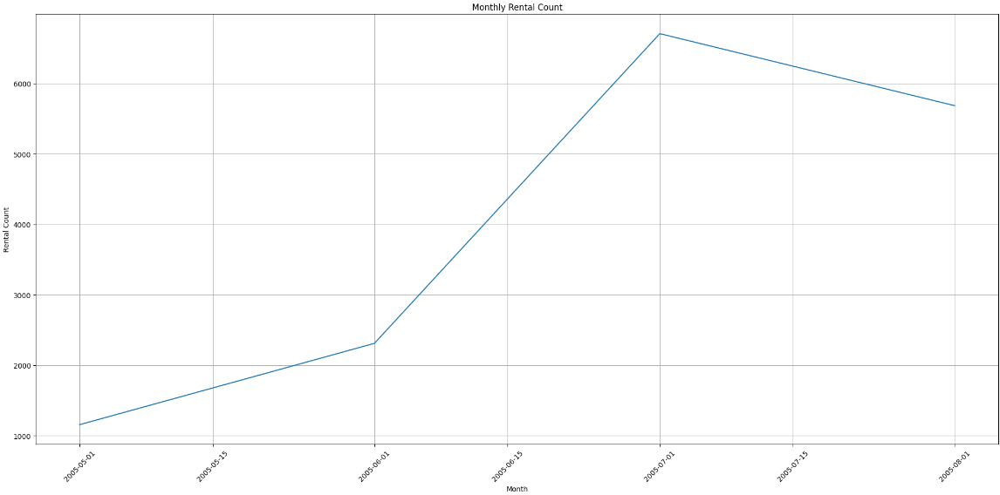
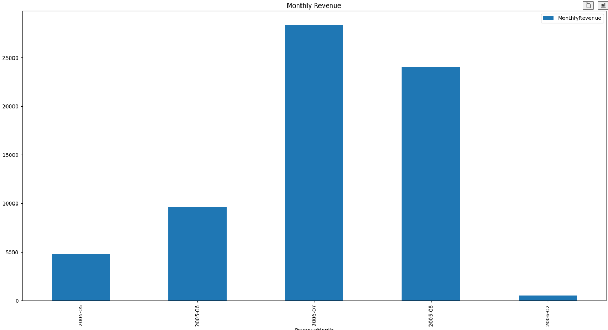

# Sakila Data Analysis Project


## Introduction


This project seeks to conduct an analysis of the Sakila database using Jupyter Notebook. The Sakila database contains diverse information about a rental company's operations, such as film rentals, customer details, payment records, etc. The analysis will encompass exploring the database, refining the data, conducting feature engineering, and constructing a linear regression model to forecast rental fees.


## Setup Instructions

To set up this project on your local machine, follow these steps:

1. **Clone the Repository**: Clone this repository to your local machine using the following command: 
```bash
git clone https://github.com/budds300/Sakila_Database_Analysis.git
```

2. **Install Dependencies**: Make sure you have Python installed on your machine. Additionally, install the required dependencies by running:
```bash
pip install -r requirements.txt
```

3. **Start Jupyter Notebook**: Launch Jupyter Notebook by running the following command in the terminal:
```bash
jupyter notebook
```
4. **Open the Notebook**: Once Jupyter Notebook starts, navigate to the project directory and open the `Sakila_Data_Analysis.ipynb` notebook.

5. **Execute the Notebook**: Execute each cell in the notebook sequentially to perform the analysis.

6. **.env Setup** To include a `.env` file and copy the details from `.env.example` to it, follow these steps:

   1. Create a new file named `.env` in the project directory.
    2. Open the `.env.example` file and copy its contents.
   3. Paste the copied contents into the newly created `.env` file.
    4. Modify the values in the `.env` file as needed, ensuring they match your local environment and configurations.

## Analysis Details

The analysis is divided into several sections:

1. **Data Loading and Exploration**: Load the Sakila dataset and explore its structure and summary statistics.

2. **Data Cleaning**: Clean the dataset by handling missing values and performing necessary data transformations.

3. **Feature Engineering**: Create new features, such as extracting titles from names and calculating family sizes.

4. **Missing Data Handling**: Fill missing values in the dataset, such as filling missing ages with the mean age of the corresponding title.

5. **Modeling**: Construct a linear regression model using statsmodels to predict ticket fares based on passenger attributes.

6. **Conclusion**: Summarize the findings and insights obtained from the analysis.


## Conclusion

In conclusion, this project provides a comprehensive analysis of the Sakila dataset using Jupyter Notebook. By following the setup instructions and executing the notebook, users can explore the dataset, perform data analysis, and build predictive models.


